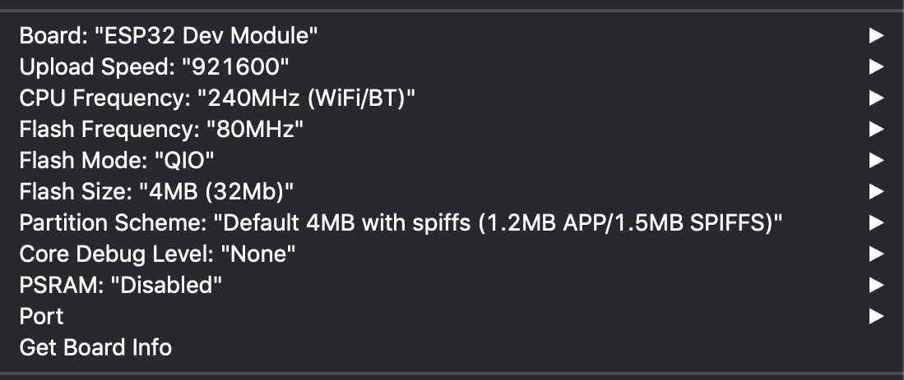

# TC0xB_Samples

Board manager to load:

https://dl.espressif.com/dl/package_esp32_index.json

Libraries To Fetch: 

Tone32 : https://github.com/lbernstone/Tone32 

SparkFun LIS3DH: https://github.com/sparkfun/SparkFun_LIS3DH_Arduino_Library

# Arduino flash settings

